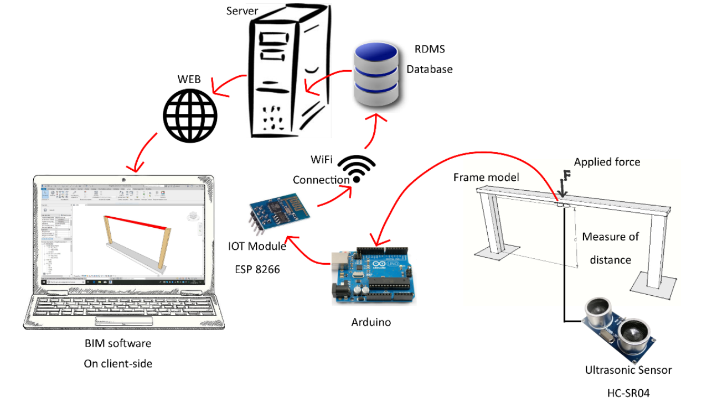
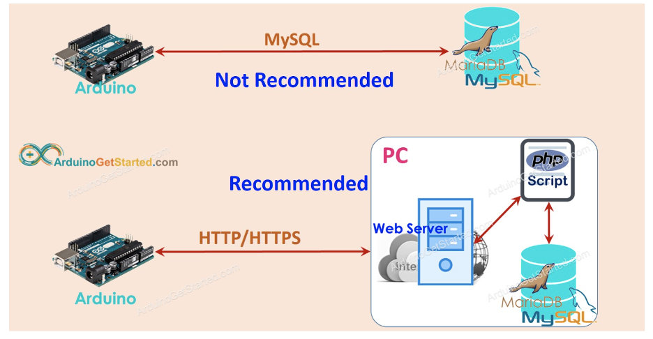
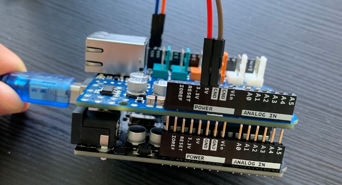
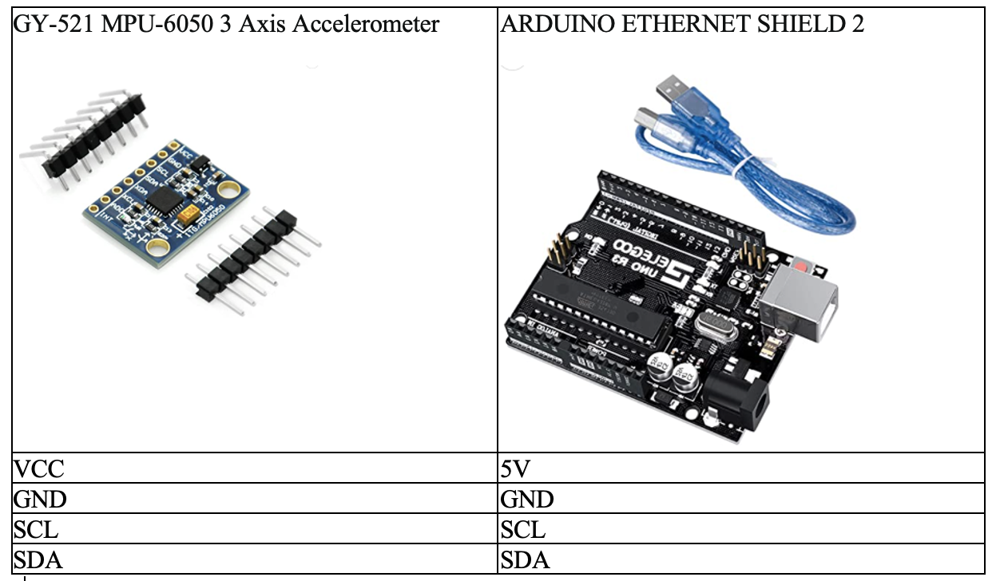
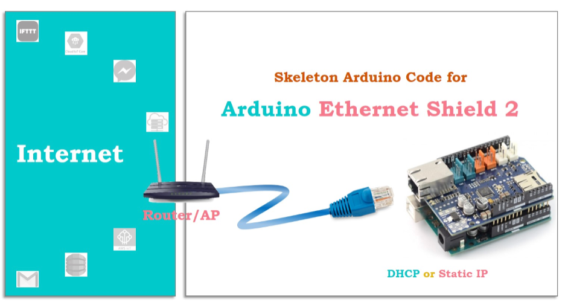

# Arduino-IOT-Sensor-Data-to-MYSQL
## About The Project

  

This project uses Arduino board to collect sensor data and store it on the MySQL database. This is a part of the <i><b>Structure Monitoring with BIM and IoT: The Case Study of a Bridge Beam Model</b></i> methodology. The goal is to establish a connection between an IoT system and a BIM model for monitoring the deflection of a bridge beam at the centreline using a schematic scale model reproduced in the laboratory and modelled in BIM. The developed system allows the real-time connection between the real model and its digital twin through the use of a relational database management system (RDBMS), to which the data detected by the sensor are transmitted, allowing the risk assessment of the real structure. This solution gives the possibility to remotely monitor, in real time, the behaviour of the structure visualized in the BIM model. 

## Getting Started

  Step 1: Arduino makes HTTP Request to Web Server

  Step 2: Web Server runs PHP script

  Step 3: PHP script gets data from HTTP Request, processes the data, and then interacts with MySQL database

  Step 4: PHP script processes the result and returns the result to Arduino via HTTP Response

  

## Hardware & Software Setup

### Hardware Used
1. Connect ARDUINO ETHERNET SHIELD 2 to Arduino Uno 

  

<a href="/https://www.youtube.com/watch?v=wTfSfhjhAU0" target="_blank">Tutorial: Gyroscope and Accelerometer (GY-521/MPU6050) with Arduino</a>
 
 

2.	Connect GY-521 MPU-6050 3 Axis Accelerometer to ARDUINO ETHERNET SHIELD  

  

 
 

3.	Connect ARDUINO ETHERNET SHIELD to a router through an ethernet cable 

  

<a href="/https://arduinogetstarted.com/tutorials/arduino-ethernet-shield-2" target="_blank">Tutorial:Arduino - Ethernet Shield</a>
 
 

### Software Used

XAMPP : <a href="https://www.apachefriends.org/download.html" target="_blank">XAMPP Download Link</a> 

Arduino IDE: <a href="https://www.arduino.cc/en/software" target="_blank">Arduino IDE Download Link</a> 

Visual Studio Code: <a href="https://code.visualstudio.com/download" target="_blank">Visual Studio Code Download Link</a>
 
 

### For more specific steps, please follow the tutorial in the link provided below 
https://arduinogetstarted.com/tutorials/arduino-mysql 

### Project Contribution

1. **Arduino Board Setup and Data Collection:** 
   - Designed and configured Arduino board to accurately collect sensor data for structural monitoring.
   - Implemented protocols for data acquisition and transmission to ensure data integrity.

2. **MySQL Database Management:**
   - Developed and maintained MySQL database structure to efficiently store sensor data.
   - Ensured optimal database performance and integrity through regular maintenance and optimization.

3. **PHP Script Development:**
   - Designed and implemented PHP scripts to handle HTTP requests from Arduino board.
   - Processed incoming data, interacted with the MySQL database, and generated appropriate responses.

4. **Integration and Communication:**
   - Established seamless communication between Arduino board, web server, and MySQL database.
   - Implemented protocols for secure data transmission and maintained data consistency across platforms.

5. **Collaboration and BIM Model Integration:**
   - Collaborated with team members to model bridge beam in BIM software.
   - Synchronized digital twin with real-time sensor data to visualize structural behavior.

6. **Risk Assessment and Real-time Monitoring:**
   - Conducted risk assessments based on data transmitted and stored in MySQL database.
   - Enabled real-time remote monitoring of structure behavior through BIM model visualization.

7. **Testing and Quality Assurance:**
   - Conducted thorough testing and debugging of the entire system to ensure reliability and functionality.
   - Implemented quality assurance measures to identify and address any potential issues or vulnerabilities.

